# PHP留言板(master)

### 基本介绍
1.   使用PHP连接数据库，具有基本的用户名、密码和验证码验证，以及用户注册
2.   无CSS，可以实现简单的留言板系统，对留言内容删除等
3.   后端PHP无字符串过滤，可使用SQL注入

### 安装环境
1.   PhpStudy
2.   PhpStrom
3.   Php7.3.4

### 配置教程
#### Phpstudy配置
1.   首先下载PhpStudy，点击该面板首页，将WINMP切换为Apache和Mysql

2.   点击该面板网站，点击管理修改，自行设置第二域名、端口，和根目录（该项目路径）
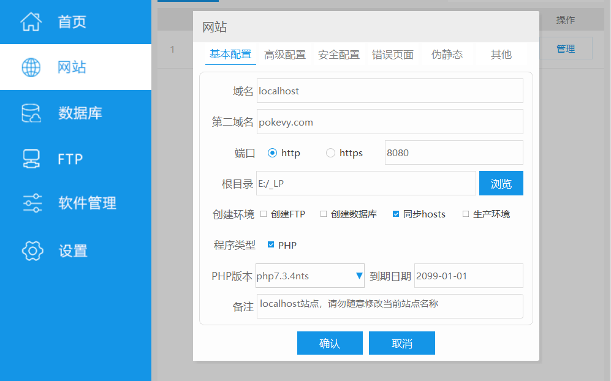

3.   点击管理网站首页，设置该网站的站点首页为index.php，
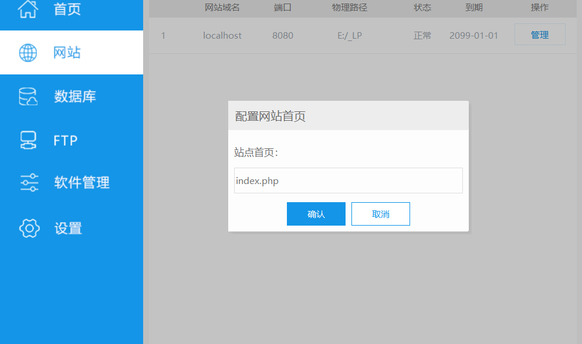

4.   点击该面板软件管理，下载SQL_Front
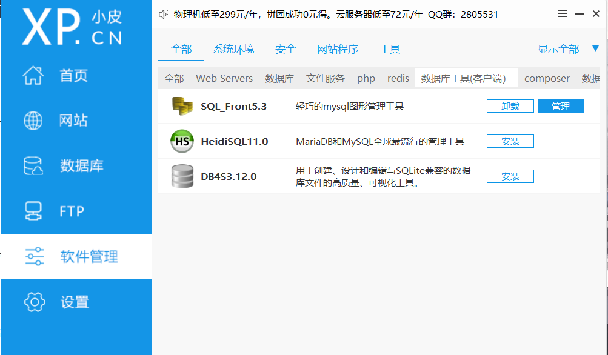

#### Sql_Front配置
1.   打开下载的SQL_Front
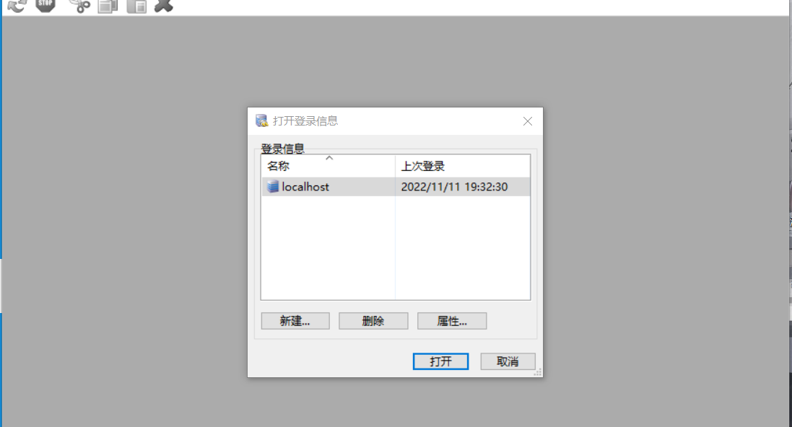

2.   右键localhost，创建数据库_lp（为什么是_lp，因为该项目中PHP代码连接的数据库名为_lp，当然你可以创建别的名字，然后在代码中修改为对应的数据库名就可以啦）
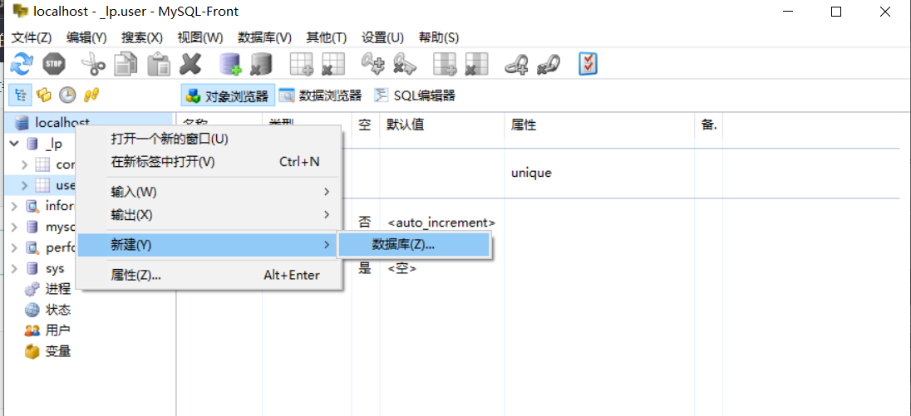

3.   右键_lp，创建两个表格，user表和comment表。其中user表主要用于保存用户名和用户密码，comment主要保存用户名，评论信息和评论时间
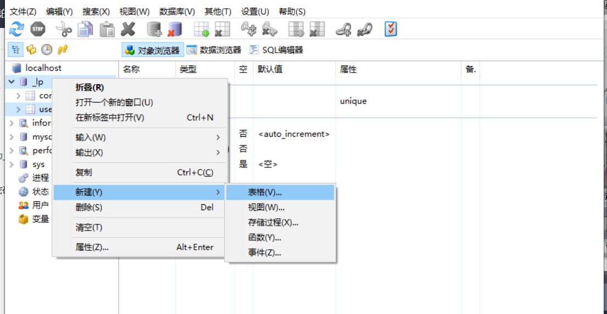

4.   按照下图在对应的表中创建对应的字段
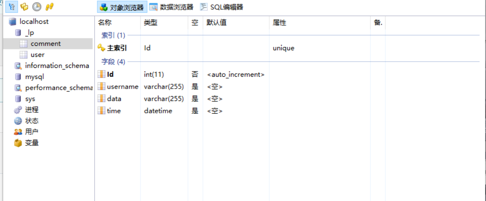

### 项目拓扑
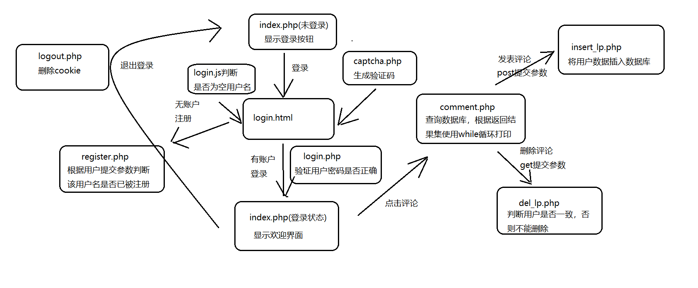

### 项目说明
#### 连接数据库（mysql.php）
1.   创建Mysql类，使用mysqli面向对象方法，声明数据库私有属性
2.   构造方法__construct用于对数据库建立连接，在此方法中实例化一个mysqli对象
3.   向方法sql传入$sql用于执行数据库命令，query函数用于执行sql语句，affecter_rows函数用于返回影响结果集
4.   方法close用于关闭对数据库的连接

#### 用户注册（register.php）
1.   首先导入mysqli.php文件，用于实例化对象建立连接
2.   定义$username和$password变量用于接受register.html中的表单post提交的用户名和密码
3.   使用new Mysql()实例化对象，随后建立sql查询语句和sql插入语句，sql查询语句用于验证该用户是否存在于数据库，sql插入语句为用户未注册则注册该用户，将用户数据插入user数据库中

#### 用户登录（index.php,login.php）
1.   在index.php中首先开启session_start用于建立会话，然后判断用户cookie信息是否为空，若为空但用户会话不为空则显式登录成功页面，为空则显式登陆页面，又或者用户cookie不为空则显式登录成功
2.   在login.php中，首先导入mysql.php文件，用于实话对象建立连接
3.   开启session_start会话，用于获取用户当前会话信息（验证码）
4.   定义$username和$password变量用于接受从login.html表中post提交的用户名和密码
5.   定义$code用于服务器生成的验证码，$verify用于获取用户输入的验证码
6.   定义$autologin用于判断用户是否点击自动登录，用于设置cookie保存时间
7.   定义checkNull函数用于判断用户名或密码是否为空，若为空则使用JS警告
8.   定义checkVerify函数用于验证用户输入验证码是否正确
9.   定义checkuser函数用于核查用户输入的密码是否正确，首先实例化对象（已连接数据库），然后调用方法sql执行sql语句，判断返回结果影响数量集不为空则返回true，否则JS警告用户名不存在或喵喵错误，返回flase

#### 退出登录（logout.php）
1.   当用户在index.php页面点击退出登录时，会跳转到该php文件，此时使用unset断开与当前用户的会话，并将用户cookie删除
2.   使用header重定向到login.html登录页面

#### 显示评论（comment.php）
1.   当用户注册并成功登录后，可点击index.php中的点击评论按钮，然后跳转到comment.php页面
2.   comment.php文件首先回合index.php文件开头一样去建立会话，然后判断用户的cookie和当前会话信息以至于用户可以正常评论，否则重定向到登录页面
3.   然后就是HTML，简单的一句话（人类的本质是什么？），简单的表单用户输入框和提交按钮和简单的表格用于显式用户评论Id、用户名、评论内容以及评论时间，通过post提交到insert_lp.php文件中
4.   此后就是实例化一个mysqli对象，建立查询语句，使用query函数执行该语句，然后使用while循环语句打印从数据库返回的信息，其中mysqi_fetch_array用于将返回内容关联为数组，则表示可以使用数据来表示返回结果信息

#### 发布评论（insert_lp.php）
1.   首先导入mysql.php文件
2.   定义$username和$data用于或从comment.php文件表单中提交的用户信息，
3.   定义$_time用于获取当前操作时间，data是获取当前时间
4.   调用insert函数（实例化对象->建立连接->插入语句->返回影响集），然后在跳转到comment.php页面，再进行评论或查看评论

#### 删除评论（comment.php，del_lp.php）
1.   在comment.php文件中有个删除链接，其中del_lp.php?username=$usr &$Id=$Id，用于向del_lp.php文件传入这两个参数
2.   当comment.php向del_lp.php传入参数后，在del_lp.php文件中首先会获取当前用户会话信息的用户名，然后判断此用户名是否与传入用户名一致，如果一致则删除，否则则JS警告
您不能删除他人评论
3.   定义check_del函数用于删除用户自己的评论，首先实例化对象—>建立连接->建立删除语句->执行语句

#### 判断输入（comment.js，login.js，register.js）
1.   comment.js中check_comment函数用于判断用于评论是否为空，为空则弹出警告，在comment.php表单onsubmit中调用此函数
2.   login.js同理
3.   register.js同理

### 转为https
1.   打开小皮面板，点击网站管理修改
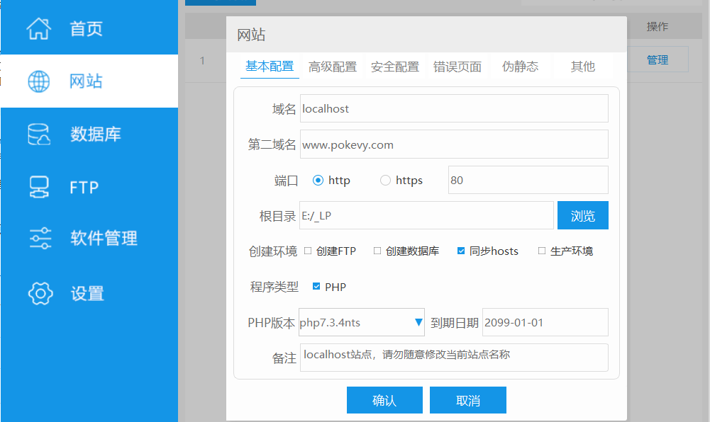

2.   点击https，点击由http转为https，点击生成开发者测试证书，然后复制公钥文件将内容保存至.cer文件中，注意此时443端口已被占用，修改其为其他端口
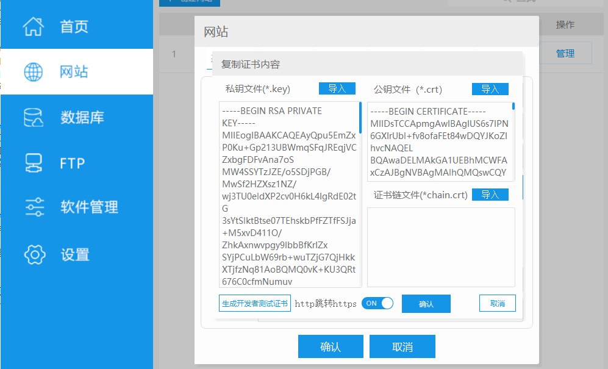

3.   打开浏览器设置页面，点击安全性管理
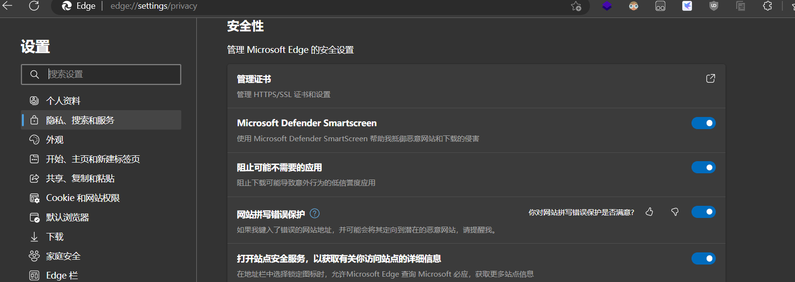

4.   点击证书管理，将刚才保存的证书导入
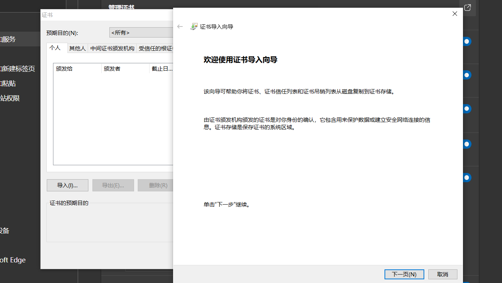

### 联系方式
1.   扣扣：981439384
2.   微信：Pokevy
